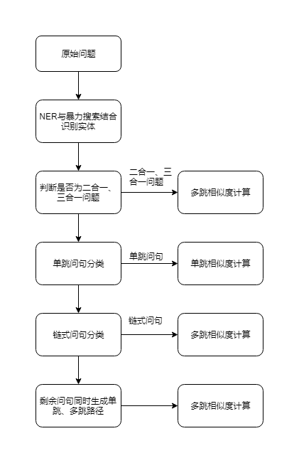
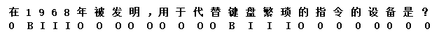
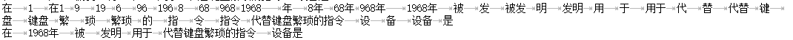

# 模型

# 实体识别及实体链接
Preprocess.ipynb：预处理文件，问句分类和构造NER数据

实体识别的结合与实体链接.ipynb：实体识别及实体链接的处理

## 实体识别(Entity Recognition)

BERT序列标注得到BIO的标注序列,将序列中的字符串拿到知识库中做精确匹配和模糊匹配，得到mention：

如：

BERT做NER的结果：

知识库暴力检索得到的实体或属性值：

精确匹配得到：1968

模糊匹配：1968年  代替键盘繁琐

最后mention结果：1968   1968年  代替键盘繁琐的指令

## 实体链接（Entity Linking）
将实体识别结果当成实体别名到mention2ent中查找实体（top8），同时将其当成属性到triples中查找属性

## 实体聚类（Entity Clustering）
所有的mention若二者在问句中的位置有重叠，将视为同一类，例如：

1968年和1968视为同一类，代替键盘繁琐的指令视为另一类，即[1968,1968年]和[代替键盘繁琐的指令]两类

# 单跳相似度模型
## 综述

1、首先我们是通过构建每个实体的候选path来完成最后的答案查找的。如下：

Question：‘莫妮卡·贝鲁奇的代表作？’

path1:‘<莫妮卡·贝鲁奇>的<代表作品>是PAD’

path2:‘<莫妮卡·贝鲁奇><代表作品>\<PAD\>’
    
当得到一个问句的时候，我们通过实体识别、实体链接，找到主题实体‘<莫妮卡·贝鲁奇>’，然后再去知识库中搜寻他的路径，最后将我们要找的答案泛化，从而得到了我们需

要的候选路径。泛化是因为答案可能不会出现在问句中，从而影响问句和path之间的语义相似度的计算。其中这些候选path的构建，是通过从‘<莫妮卡·贝鲁奇>’去知识库中寻

找他所对应的所有关系，然后完成候选路径构建。

在训练的时候，我们采用了1:100的正负例，完成：

‘1\t莫妮卡·贝鲁奇的代表作？\t<莫妮卡·贝鲁奇><代表作品>\<PAD\>’OR
    
‘1\t莫妮卡·贝鲁奇的代表作？\t<莫妮卡·贝鲁奇>的<代表作品>是PAD’  的两个句子拼接。

我们将正确的que-path句子标为1，错误的标为0.从而转化为一个拼接句子的二分类问题。但是，不是每一个实体都会含有100个负例（对于这个问句而言是错误的关系路径）。

因此我们构建了知识库中的关系候选集，当实体的负例不足100个时，我们会从关系候选集中随机选择，进行补足到100个。（1:100是我们经过测试得到的最好的比例）

由于是随机从关系候选集中抽取，所以模型之间的差异有时候会很大，有些实体可能根本不会和我们补足的关系有关联，例如：‘姚明的妻子是谁？姚明-董事长-PAD’，对于

这种问句对需要多训练几次，来取其中最好的。来我们又想到了采用path自然语言化，加入‘的’和‘是’，通过这种方法来解决这种不存在的关系对模型识别效果的影响，如

‘姚明的妻子是谁？<姚明>的<董事长>是\<PAD\>’，有了这两个词，可以很明显的区别出姚明和董事长之间的关系，否则很可能给模型一种‘姚明董事长’的错误信息理解。

我们采用了取模型最好的前四个，进行了四模型融合，其中在均值融合和最大值融合中，我们选择了效果比较好的最大值融合，下面是四个模型所用的数据。

## 模型训练数据

1、一种数据格式是直接采用三元组的形式，例如：<姚明><妻子>\<PAD\>。然后去和问句结合成为一组句对：‘姚明的妻子是谁？<姚明><妻子><PAD>’
    
采用这种数据格式的是 No2_Model_en_rel_5轮 模型。

2、另外一种数据格式，是加入‘的’和‘是’，达到对path自然语言化，例如：<姚明>的<妻子>是<PAD>。然后去和问句结合成为一组句对，例如：
    
 <姚明><妻子>\<PAD\> --> <姚明>的<妻子>是\<PAD\>。采用这种数据格式的是：
    
No1_Model_nature_en_rel_ori

No3_Model_nature_en_rel_5轮

No4_Model_nature_en_rel_3轮 

三个模型。其中Nox是指效果的从高到低命名。

# 多跳相似度模型
## 综述

对于多跳问句相似度计算，我们也采用的是问句对和path组成句子对，进而采用二分类的方式去完成相似度计算。

例如‘发明显微镜的人是什么职业？’，对应的正例是：‘<显微镜><发明人><职业><pad>’。那么其余的负例应该是以‘<显微镜>’为节点，去知识库中寻找一周，找到所有的
    
一跳范围内的Rel和Obj，构成第一跳路径。例如‘<显微镜><中文名><pad>’，然后继续按照‘<显微镜><中文名>’去寻找它的Obj，找到后，继续完成第二跳的路径查找。例如：
    
‘<显微镜><中文名><外文名>\<pad\>’，这样就完成了两跳路径的匹配。
    
不过，这里的训练数据构成只限于链式问句的数据，因为两跳问句种类太多，

可参考https://note.youdao.com/ynoteshare1/index.html?id=16ffe9a227f10f94e0b765e3f2038396&type=note

其他种类的问句结构比较复杂，从结构上来看‘<显微镜><发明人><职业>\<pad\>’这样的路径顺序已经覆盖了较大比例的问句答案路径。因此目前的多跳问句相似度计算都采用
    
链式模型的方式来解决。
## 模型训练数据

1、一种数据格式是直接采用链式两跳三元组的形式去解决，例如：‘<显微镜><发明人><职业><pad>’。然后去和问句结合成为一组句对：    
    
‘发明显微镜的人是什么职业？<显微镜><发明人><职业><pad>。采用这种数据格式的是：No2_ori_ccks_nlpcc5轮 模型。
    
    
2、另外一种数据格式是加入‘的’和‘是’，达到对path自然语言化，例如：‘<显微镜><发明人><职业><pad>’。然后去和问句结合成为一组句对：
    
‘发明显微镜的人是什么职业？<显微镜>的<发明人>的<职业>是<pad>。采用这种数据格式的是：No1_nature_6轮、No3_nature_7轮 模型。

# 多合一问题判定
多合一包括二合一、三合一、四合一问题，判定条件如下：

1. 实体聚类为多类

2. 所有类别实体间有至少一个交集

如：于小彤饰演了红楼梦中的哪个角色？ 

<贾宝玉_（红楼梦人物）><登场作品><红楼梦_（中国古典长篇小说四大名著之一）>

 <贾宝玉_（红楼梦人物）><饰演><于小彤>

 其中<红楼梦>和<于小彤>之间有交集<贾宝玉>，认定为二合一问题。
 
# 单跳问句和链式问句分类
通过识别训练与验证集中问句对应的sparql语句对问句进行分类，训练一个问句分类器对问句进行分类

# 规则

# 预解空间

# 路径融合

# 答案融合